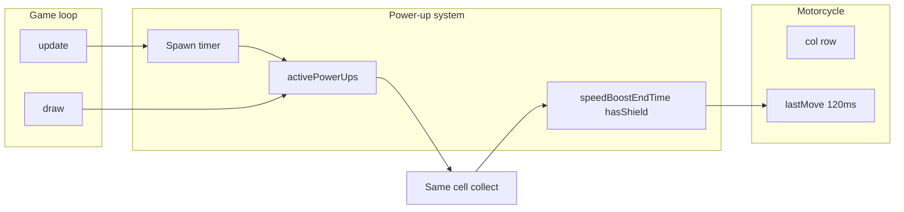

# Feature 2: Power-Ups — Plan (Updated for Base MVP)

**Source:** [teams/team_12/prd.md](teams/team_12/prd.md) (Feature 2)  
**Base to extend:** [teams/team_12/base_mvp/index.html](teams/team_12/base_mvp/index.html)

Add collectible power-ups: **speed boost** (yellow lightning, temporarily doubles movement speed) and **shield** (blue circle, one free hit). Items spawn randomly on the road, last a few seconds, then disappear.

---

## Base MVP Summary (What Exists)

- **Config:** `COLS = 10`, `ROWS = 11`, `CELL = 60` — use these for all power-up positions and drawing.
- **Game state:** `game` object holds `moto: { col, row }`, `lanes`, `score`, `highScore`, `lives`, `gameOver`. No power-up state yet.
- **Movement:** Input-based with throttle: `handleInput()` in `update(dt)`; movement is discrete (`game.moto.col` / `game.moto.row` ±1). Throttle is **120ms** (`game.lastMove`, line 131). So **speed boost = halve the throttle** (e.g. 60ms) so the player can move twice as often — not “double movement per frame.”
- **Collision (vehicles):** Lines 162–182. In a traffic lane, checks `motoLeft`/`motoRight` vs vehicle bounds. On hit: `game.lives--`, possibly `game.gameOver`, reset moto to `(4, ROWS - 1)`. **Shield:** Before doing that, check `if (game.hasShield)` → set `game.hasShield = false` and skip losing life / reset.
- **Draw order:** `clearRect` → lanes → vehicles → motorcycle → `drawHUD()` → game over overlay. **Insert power-ups:** after vehicles, before motorcycle (so they sit on the road, bike on top).

---

## Architecture

- **Active power-ups:** Array of `{ type, col, row, spawnTime }` (grid-aligned; collect when `moto.col === p.col && moto.row === p.row`).
- **Active effects:** `speedBoostEndTime` (timestamp, 0 = off), `hasShield` (boolean). Shield consumed in the existing vehicle-collision block.

---

## Phase 1: Data Model and Spawning

| Track | Task | Details |
|-------|------|--------|
| **1A** | Power-up state and constants | In CONFIG or after COLORS: `POWERUP_TYPES = { SPEED: 'speed', SHIELD: 'shield' }`, `POWERUP_DURATION_MS = 5000`, `POWERUP_SPAWN_INTERVAL_MS = 8000`. On `game`: `activePowerUps: []`, `speedBoostEndTime: 0`, `hasShield: false`, `lastPowerUpSpawn: 0`. |
| **1B** | Spawn logic | In `update(dt)`, after `if (game.gameOver) return`: if `now - game.lastPowerUpSpawn >= POWERUP_SPAWN_INTERVAL_MS`, push `{ type: random of SPEED/SHIELD, col: 0..COLS-1, row: random from [1,2,3,4,6,7,8,9] (traffic rows), spawnTime: Date.now() }`, set `game.lastPowerUpSpawn = now`. Use existing `COLS`, `ROWS`, `CELL` only. |
| **1C** | Expiry | In same `update`, filter `game.activePowerUps` to remove items where `Date.now() - p.spawnTime > POWERUP_DURATION_MS`. |

**Deliverable:** Power-ups appear in state and expire; no rendering yet.

---

## Phase 2: Rendering

| Track | Task | Details |
|-------|------|--------|
| **2A** | Draw speed boost | In a new `drawPowerUps()` (called from `draw()` **after** vehicles, **before** motorcycle): for each `p` with `p.type === POWERUP_TYPES.SPEED`, draw a **yellow lightning bolt** at `p.col * CELL`, `p.row * CELL` (e.g. center `cx = p.col * CELL + CELL/2`, `cy = p.row * CELL + CELL/2`). Use `COLORS` or add e.g. `powerup_speed: '#ffdd57'`; simple path/zigzag or triangle. |
| **2B** | Draw shield | Same loop: for `p.type === POWERUP_TYPES.SHIELD`, draw a **blue circle** at same center (e.g. radius ~20px). Optionally outline. Add e.g. `powerup_shield: '#4fc3f7'` to COLORS. |

**Deliverable:** Both power-up types visible; they spawn and disappear on schedule.

---

## Phase 3: Collision and Collection

| Track | Task | Details |
|-------|------|--------|
| **3A** | Collection check | In `update(dt)`, after vehicle movement and before vehicle-vs-moto collision: loop `game.activePowerUps`. If `p.col === game.moto.col && p.row === game.moto.row`, collect: remove `p` from array, then if SPEED set `game.speedBoostEndTime = Date.now() + 4000`, if SHIELD set `game.hasShield = true`. Use a backwards loop or filter so removal is safe. |
| **3B** | No double-collect | Removing the item in the same frame guarantees no double-collect. |

**Deliverable:** Driving into a power-up cell collects it and applies the effect.

---

## Phase 4: Timed Effects (Behavior)

| Track | Task | Details |
|-------|------|--------|
| **4A** | Speed boost | In `handleInput()` (line 131): replace the fixed `120` with a variable: e.g. `const throttleMs = (Date.now() < game.speedBoostEndTime) ? 60 : 120;` and use `if (now - game.lastMove < throttleMs) return;`. |
| **4B** | Shield (one free hit) | In the vehicle collision block (lines 166–181): wrap the “Hit!” logic in `if (!game.hasShield) { game.lives--; ... reset; return; } else { game.hasShield = false; return; }` so one collision consumes shield and does not deduct life or reset position. |
| **4C** | Reset on restart | In `restartGame()`, set `game.speedBoostEndTime = 0`, `game.hasShield = false`, `game.activePowerUps = []`, and optionally `game.lastPowerUpSpawn = 0`. |

**Deliverable:** Speed boost halves throttle for 4s; shield absorbs one hit; restart clears effects.

---

## Phase 5: Integration and Polish

| Track | Task | Details |
|-------|------|--------|
| **5A** | Spawn bounds | Spawn only on traffic rows 1,2,3,4,6,7,8,9; random col in `[0, COLS-1]`. Avoid spawning on same cell as moto: if `p.row === game.moto.row && p.col === game.moto.col`, skip or re-roll. |
| **5B** | Visual feedback (optional) | While `Date.now() < game.speedBoostEndTime`: subtle tint or “fast” effect on bike. While `game.hasShield`: small blue ring or icon near bike. Keep minimal. |
| **5C** | Tuning | Document constants at top (or in a short comment): `POWERUP_DURATION_MS`, `POWERUP_SPAWN_INTERVAL_MS`, speed boost duration (4000), throttle values (120 / 60). |

**Deliverable:** Fair spawns, optional feedback, easy tuning.

---

## Exact Touch Points in [base_mvp/index.html](teams/team_12/base_mvp/index.html)

| Location | Change |
|----------|--------|
| After COLORS (e.g. ~line 65) | Add power-up constants; add on `game`: `activePowerUps`, `speedBoostEndTime`, `hasShield`, `lastPowerUpSpawn`. |
| `handleInput()` (~line 131) | Use throttle that depends on `game.speedBoostEndTime` (60ms vs 120ms). |
| `update(dt)` start (after gameOver check) | Spawn new power-up by interval; expire old power-ups; collect power-ups when moto same cell. |
| Vehicle collision block (~166–181) | Wrap hit logic in `if (!game.hasShield) { ... } else { game.hasShield = false; return; }`. |
| `draw()` | After “Draw vehicles” block, call `drawPowerUps()`; then draw motorcycle. |
| New function | `drawPowerUps()`: loop `game.activePowerUps`, draw SPEED (yellow bolt) or SHIELD (blue circle) at `p.col * CELL`, `p.row * CELL`. |
| `restartGame()` | Reset `speedBoostEndTime`, `hasShield`, `activePowerUps`, `lastPowerUpSpawn`. |

---

## Conflicts and Mitigations

- **Single file:** All edits are in `index.html`. To reduce merge conflicts: add power-up logic in **clear sections** (one block for spawn/expire/collect, one for draw, one for shield in collision) and keep changes minimal in shared areas (e.g. only add the shield condition in the existing collision block).
- **Shield vs lives:** The vehicle collision block already handles “lose life and reset.” The plan uses a single `if (!game.hasShield)` wrapper so no separate “hook” from Feature 1 is required; power-up feature owns the shield check.
- **Draw order:** Fixed: lanes → vehicles → **power-ups** → motorcycle → HUD → game over. Feature 3 (exhaust, shake) can insert after motorcycle or around HUD without conflicting with power-up draw if they follow this order.

---

## Suggested Order of Work

1. Phase 1 (1A → 1B → 1C) — state, spawn, expiry.
2. Phase 2 (2A, 2B) — draw both types in `drawPowerUps()`.
3. Phase 3 (3A, 3B) — collection in `update`.
4. Phase 4 (4A, 4B, 4C) — throttle in `handleInput()`, shield in collision, restart reset.
5. Phase 5 (5A, 5B, 5C) — spawn bounds, optional feedback, tuning.

This extends the existing game without changing its core loop shape; only small, localized edits and one new draw function.
